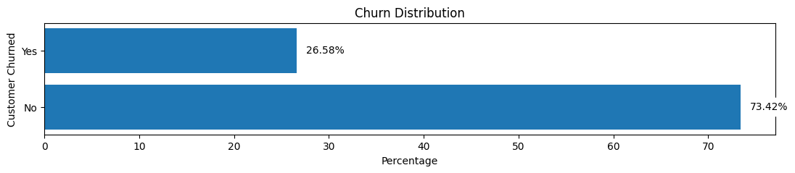
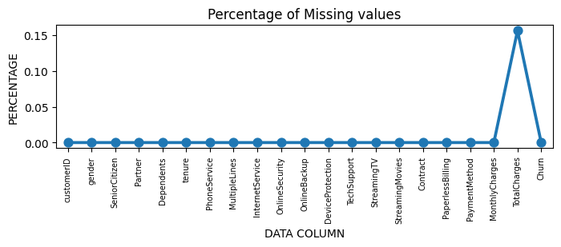
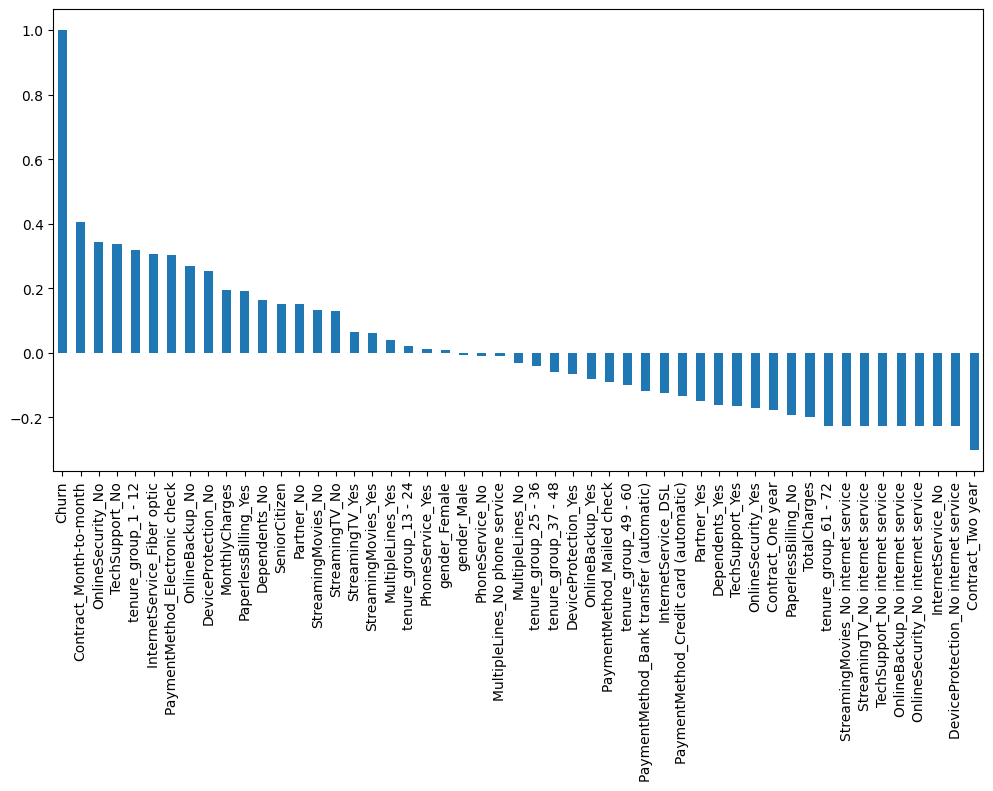
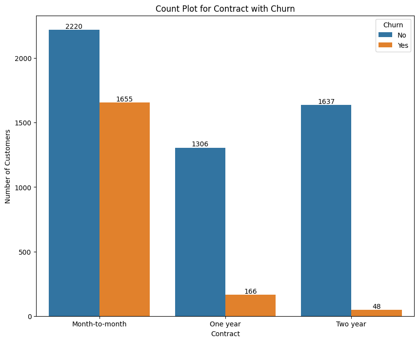
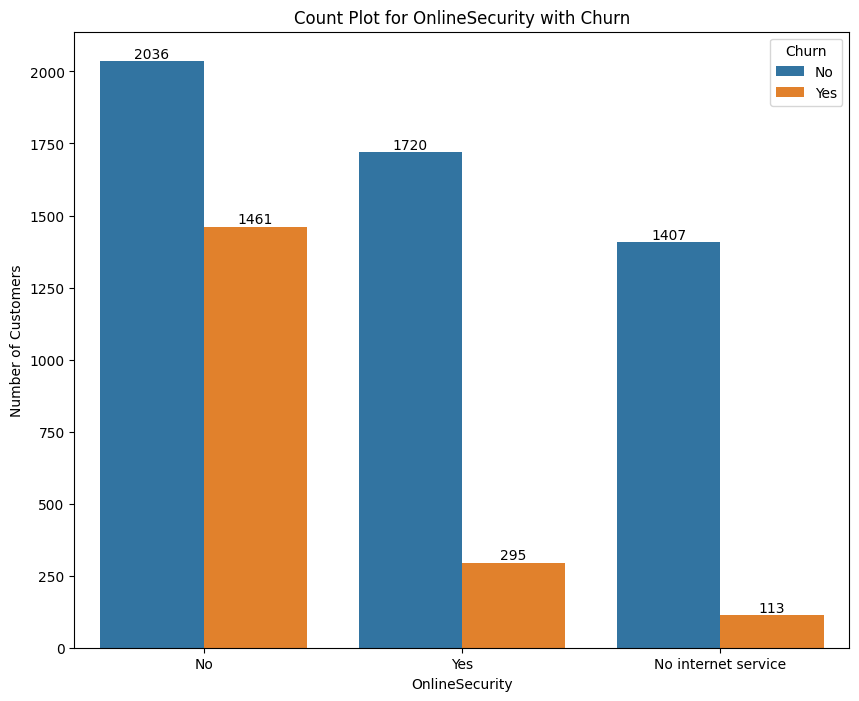
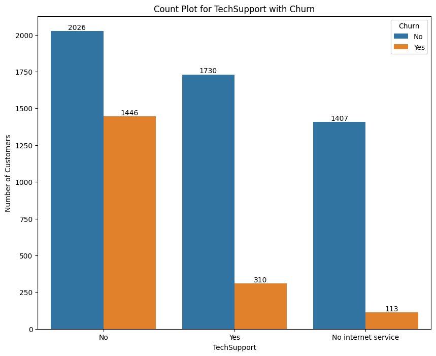

# Telecom Customer Churn Analysis

## Business Understanding and Overview

In the telecom industry, preventing customer churn is crucial for long-term success. This data analysis focuses on understanding customer attrition by conducting Exploratory Data Analysis (EDA) using Python. The goal is to uncover patterns and insights that guide informed decision-making.

### Target Variable
Initial findings show an overall churn rate of 26.58%, serving as our base target value for future comparisons.

### Missing Data Analysis

#### Data Type Correction:
- "Total Charges" column data type corrected to float64 for accurate analysis.

#### Handling Null Values:
- 11 null records in "Total Charges" (0.15% of data) were dropped, resulting in 7032 records.

### Data Cleaning

#### Tenure Grouping for Visualization:
- "Tenure Months" grouped into six bins for improved visualization, creating a new column, "tenure_group."

#### Irrelevant Column Removal:
- "Customer ID" and "Tenure" dropped as irrelevant for focused analysis.

### Initial Findings of Univariate Analysis

- Converted categorical values to numerical using get_dummies.
- Explored correlations between numerical features and "Churn" column.
- Identified attributes associated with higher churn rates.
  

## Univariate Categorical Analysis Highlights

- Customers with attributes like month-to-month contracts (42.71%), no online security (41.78%), no tech support (41.65%) exhibit higher churn.
  

# Customer Churn Analysis

## Univariate Insights

- Customers with less than 1 year of tenure have a churn rate of 47.68%.
- Users who choose electronic check as their payment method show a higher likelihood of churn at 45.29%.
- Month-to-month contract subscribers exhibit a higher churn rate of 42.71%.
- Customers using Fiber Optic (41.89%) instead of DSL (19.00%) are more prone to churn.
- Senior Citizens have a relatively higher churn rate of 41.68%.
- Customers without the following features Online Security (41.78%), Tech Support (41.65%), Online Backup (39.94%), and Device Protection (39.14%) are more likely to churn.
- Paperless Billing Method users have a churn rate of 33.59%, surpassing conventional paper billing at 16.38%.
- Customers without partners (32.98%) are more likely to churn than those with partners (19.72%).
- Customers without dependents (31.28%) are more likely to churn than those with dependents (15.53%).
- Not streaming Movies (33.73%) and not streaming TV (33.54%) contribute to a higher likelihood of churn.

## Bivariate Analysis

**Key Insights: Unveiling Churn Patterns through Bivariate Analysis**

- Customers with less than 1 year of tenure (47.68%), especially with fiber optic services (29.61% more) and paperless billing (24.19% more), are more likely to churn.
- Users selecting electronic check payments (45.29%), particularly without tech support (26.67% more) and choosing fiber optic, amplify vulnerability.
- Month-to-month contract subscribers (42.71%), especially with fiber optic services, reveal an increasing churn pattern; females in this group are 2.05% more likely to churn than males.
- Senior Citizens exhibit a relatively higher churn rate of 41.68%, particularly with a contract less than a year and in the absence of a partner.
- Customers without online backup (39.94%) and security (41.78%) play a major role in churn, with a 28.42% higher likelihood compared to users with online security and no online backup.
- Customers without device protection (39.14%), especially with fiber optic services, and without partners (14.43% more) and dependents (16.75% more), are more inclined to churn.
- Customers without partners (32.98%), females in this group are 2.91% more likely to churn than males.
- Customers not streaming movies (33.73%), particularly with fiber optic services (23.38% more) and without partners (14.64% more), are more likely to churn. Additionally, customers not streaming both movies and TV have a 2.65% higher likelihood of churning compared to users streaming TV and not movies.

## Final Thoughts

Our exploratory data analysis (EDA) delved into telecom customer churn, revealing a substantial overall churn rate of 26.58%. 
Customers with less than 1 year of tenure (47.68%), especially with fiber optic services (29.61% more) and paperless billing (24.19% more), stand out as a segment prone to churn.
Users opting for electronic check payments (45.29%), particularly without tech support (26.67% more) and choosing fiber optic, amplify the vulnerability, emphasizing the need for payment-related interventions.
Month-to-month contract subscribers (42.71%), especially with fiber optic services, exhibit a concerning churn pattern. Females in this group are 2.05% more likely to churn than males, signifying contract choices influence customer loyalty.
Senior Citizens (41.68%) show a relatively higher churn rate, especially with a contract less than a year and without a partner, underscoring the unique considerations for this demographic.
Customers without online backup (39.94%) and security (41.78%) play a pivotal role in churn, with a 28.42% higher likelihood compared to users with online security and no online backup. This emphasizes the importance of ensuring customers are more focused on security.
Customers without device protection (39.14%), particularly with fiber optic services, and without partners (14.43% more) and dependents (16.75% more), are more inclined to churn, highlighting the need for comprehensive service packages.
Customers without partners (32.98%), especially females in this group (2.91% more likely to churn than males), underscore the influence of relationship status on churn dynamics.
Customers not streaming movies (33.73%), particularly with fiber optic services (23.38% more) and without partners (14.64% more), demonstrate a higher likelihood of churn. Additionally, those not streaming both movies and TV have a 2.65% higher likelihood of churning, emphasizing the significance of entertainment preferences.

## Next Steps: Predictive Analytics

- Utilizing Machine Learning: Dive into constructing a robust machine learning model to leverage the insights gathered.
- Proactive Retention Strategies: Apply predictive analytics to forecast potential churners, facilitating the implementation of proactive retention strategies.

